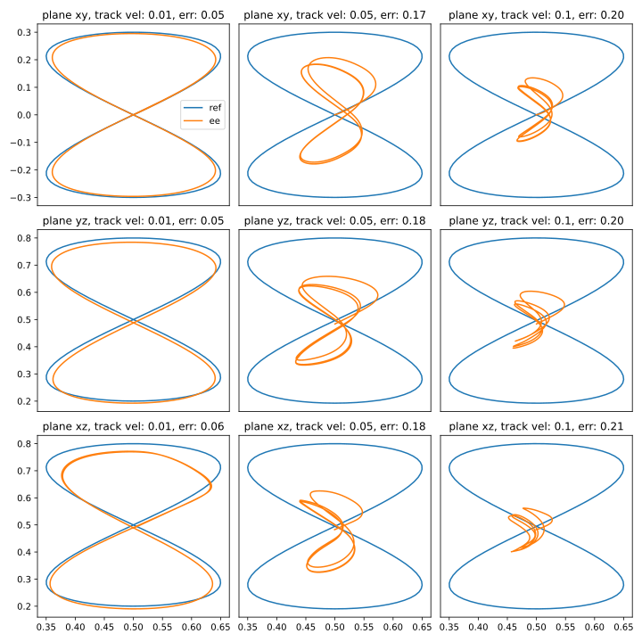
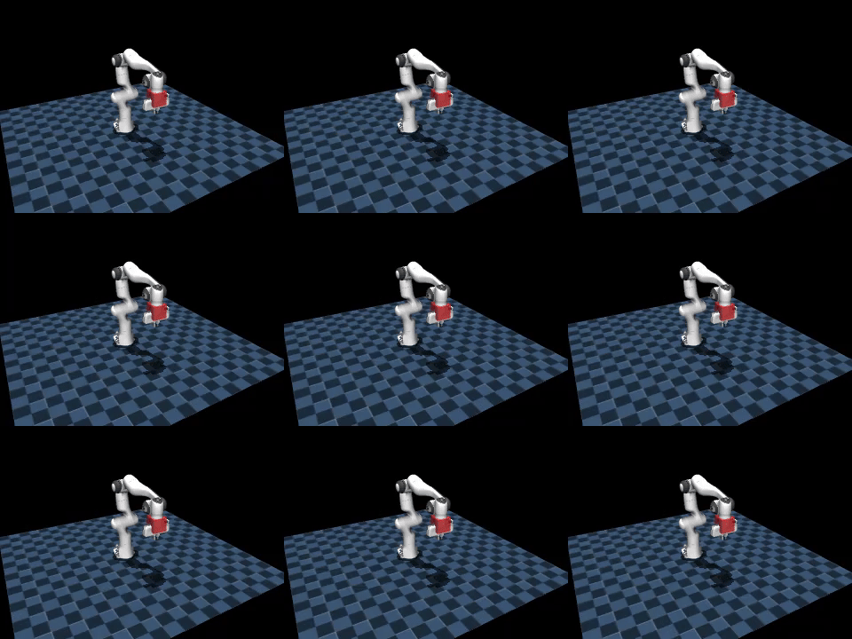

# IK Tests for Franka Panda

This repository provides a rough framework for testing inverse kinematics (IK) implementations on the Franka Panda robot in MuJoCo. 

## Features

- Track figure-8 trajectories in the **XY, YZ, and ZX** planes using IK
- Record the end-effector motion in MuJoCo
- Compute tracking metrics (e.g. mean position error)
- Save videos of robot motions for inspection
- Plot reference vs executed trajectories for analysis

## Basic Test Example

The basic test uses a figure-8 trajectory in one of the planes and evaluates the IK solver's performance. The following is an example result:

### Trajectory Plot



### Robot Motion Video



The above plots/videos were generated in `run_ik_tests.ipynb`.

## Installation

Install dependencies using [uv](https://docs.astral.sh/uv/):

```bash
uv pip install -e .
```

## Acknowledgement

The differential IK implementation used here has been adapted from [https://github.com/kevinzakka/mjctrl/](https://github.com/kevinzakka/mjctrl/).